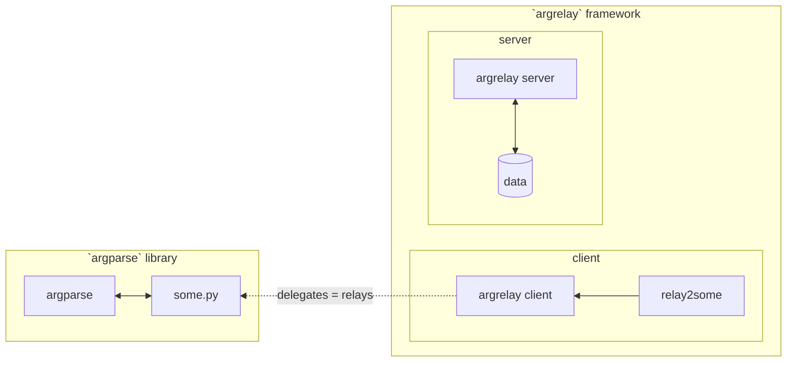

This doc is supposed to clarify how commands run under `argrelay` work 
via side-by-side comparison of (independent) `argparse` _library_ and `argrelay` _framework_.

| Category       | `argparse` is a library                                    | `argrelay` is a framework                                                      |
|:---------------|:-----------------------------------------------------------|:-------------------------------------------------------------------------------|
| Given:         | `some.py` is some script                                   | `relay2some` is a "wrapper" command  configured in Bash to call `argrelay` |
| In Bash:       | type `some.py` to execute it                               | type `relay2some` to let `argrelay` decide  whether to execute `some.py`   |
| Execution:     | `some.py` calls `argparse` library                         | `some.py` is called by the framework  when `relay2some` is invoked         |
| Function:      | `some.py` directly does  domain-specific task          | `relay2some` directly only "relays"  the command line to `argrelay`        |
| CLI source:    | `some.py` defines its CLI  itself via `argparse`       | CLI for `relay2some` is defined by  the framework via configs/plugins/data |
| CLI is:        | mostly code-driven                                         | mostly data-driven                                                             |
| Modify CLI:    | modify `some.py`                                           | keep `some.py` intact,  re-configure `argrelay` instead                    |
| Prog lang:     | `some.py` has to be  a Python script to use `argparse` | `some.py` can be anything  somehow executable by `argrelay`                |
| **Important:** | `some.py`/`argparse` have  no domain data to query     | `relay2some` may access any  domain data from `argrelay` server            |

