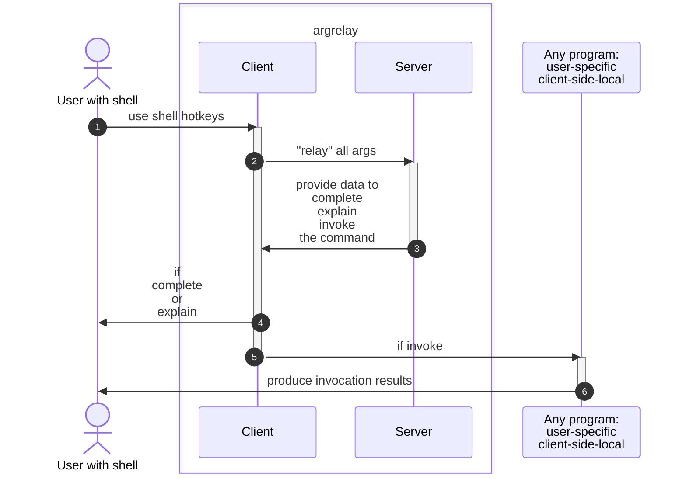
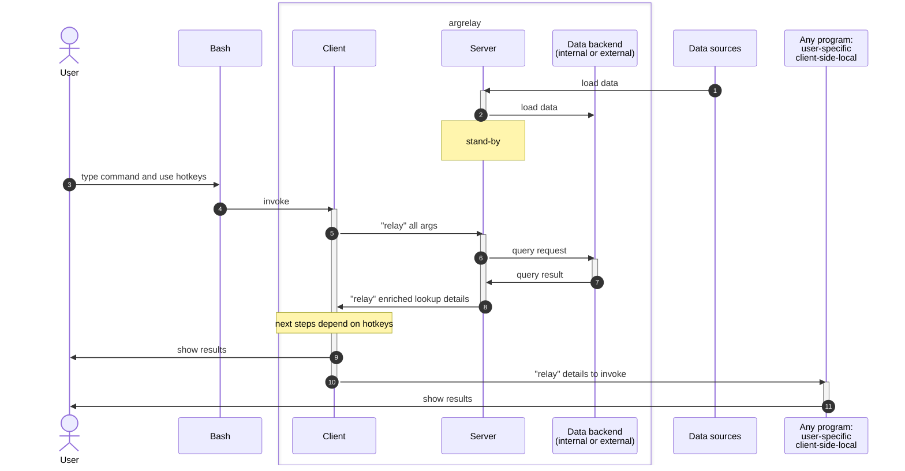

[](https://badge.fury.io/py/argrelay)
[](https://github.com/argrelay/argrelay/actions/workflows/argrelay.bootstrap.yaml)

<!--
    FS_84_11_73_28: supported python versions:
-->

Supported:
*   Linux
*   Bash >= 4.0
*   Python >= 3.9

<a name="argrelay-secreencast"></a>

<!--
[](https://asciinema.org/a/LTHj0DHN2kfXJCHCGuJugNG4P)
-->

[](https://www.youtube.com/shorts/ZjPcOBy3cbU)

<!--
See: docs/dev_notes/screencast_notes.md
-->

<a name="argrelay-about"></a>

# What is `argrelay`?

A **human interface** into "automation arsenal" with built-in search for scripts & their input data.

### A longer answer:

A wrapper for command line interface (CLI) tools to simplify input selection.<br/>
It integrates shell + client + server to search loaded **custom data**<br/>
navigating **custom schema** via CLI args directly in the **standard shell**.

*   Although its initial purpose was command **auto-completion**, that become a trivial byproduct of...
*   Its primary feature: (tag|label|keyword|attribute)-based **structured data search**.

### Probably the best answer:

:star: :star: :star: :star: :star:

You may find it easier to **get the idea through examples** in [`the_problem_argrelay_solves.md`][the_problem_argrelay_solves.md]<br/>
and ignore the rest of this `readme.md` (to avoid reading distilled claims).

# When is it needed?

It solves **the single most annoying problem** to know what to type next **in the middle of typing**.

*   When command args relate to sizeable data **incomprehensible or difficult** to<br/>
    review, select, browse, discover on the spot.

*   When knowledge about ( non-standard | undocumented ) "enterprise automation" scripts is<br/>
    constantly **invalidated** by frequent updates of code & data.

`argrelay`-registered functions are **queryable** - they use schemas with<br/>
loaded data to contextually limit possible options to locate or auto-complete them.

<a name="argrelay-general-dilemma"></a>
<a name="argrelay-purpose"></a>

# Why is it for shell?

[It is not necessarily only for shell][argrelay_org],<br/>
but there is an **oversupply** of GUI-s (and they do not integrate with scripts).

### Vacant niche:

CLI is indispensable for **rapidly evolving custom tools**:
*   [A] **ubiquitous automation** (any command is effectively **replay-able code**)
*   [B] **quick implementation** (get it done "in the afternoon" without **drilling fullstack** API whole month)
*   [C] ultimate **manual intervention** (when everything else is already failed and unavailable)

### Accepting the problem:

Achieving all three [A, B, C] is **nearly impossible without** CLI.

### Devising a solution:

Make CLI more human-efficient by reducing manual and guess work:
*   enable **inline search directly in shell** (without copying-and-pasting args from other apps)
*   reduce cognitive load via feedback **eliminating syntax and options memorization**
*   unify interaction for all registered commands via **data-driven** framework

See also ["general dilemma"][general_dilemma].

<a name="argrelay-execution"></a>

# How does it work?

It employs the same shell API as auto-completion for any other (e.g. `ls` or `git`) command,<br/>
except that requests go to the server with its **plugin**-s to run search logic against **indexed** data<br/>
(instead of processing requests locally by querying the file system).

<a name="argrelay-name"></a>

### It is in the name:

Essentially, sitting between the user shell and the user program,<br/>
`argrelay` "relays" command line args (hence, the name) to the server on each request,<br/>
then it uses response data to complete/explain/invoke the command for the user:



See ["full picture"][full_picture] below.

<a name="argrelay-scenario"></a>

### Typical scenario:

*   Human types in some **remembered** args (via `Tab`-auto-completion) in **relaxed syntax and order**.

*   Machine provides feedback (via `Alt+Shift+Q`-query) on the progress of the input interrogation.

    It tells:

    *   What args machine **already matched** with the data according to **command schema**.

    *   What **else** machine needs from human to **disambiguate** and select the remaining command args.

Try ["interactive demo"][interactive_demo] below.

<a name="argrelay-request-hotkeys"></a>

### Request hotkeys:

| Local Bash:       | Remote Server:                      | Local Client:                               |
|-------------------|:------------------------------------|:--------------------------------------------|
| **`Alt+Shift+Q`** | reports existing and missing input  | displays command input interrogation status |
| **`Tab`**         | suggests options for missing input  | lists options to Bash for auto-completion   |
| **`Enter`**       | provides data to invoke the command | executes the command                        |

Apart from the trivial `Enter` to execute command,</br>
`Tab` and `Alt+Shift+Q` hotkeys are configured via [`Readline`][readline_config] library Bash relies on.

# How to use it?

The simplest way is to fork|branch the repo and wrap the intended logic following an example:

*   **Implement loader plugin** to load objects and index their properties for selection via CLI.

    For example, `ssh` wrapper may use generic loader for static file with data -<br/>
    see few destinations with multiple properties in [`ConfigOnlyLoader.ssh_dst_group.data.yaml`][ssh_loder_data].

*   **Implement delegator plugin** to wrap the logic requiring arguments selection.

    For example, `ssh` wrapper may use selected destinations,<br/>
    see `invoke_action` func in [`DelegatorSshDst.py`][ssh_delegator_code].

Try ["interactive demo"][interactive_demo] while changing code and data from that example to<br/>
see how CLI arguments are matched against properties of the `ssh` destinations loaded by the loader.

Ultimately, `argrelay` can be used as dependency for a [separate project][bootstrap_procedure.1.project_creation.md]
(in its own another repo).

<a name="argrelay-demo"></a>

# Interactive demo: starting and stopping

There are two ways to start demo:

*   Using `docker` image:

    ```sh
    docker run -it argrelay/demo
    ```

*   Using `git` sources:

    This is a non-intrusive demo (e.g. without permanent changes to `~/.bashrc`).

    Clone this repo somewhere (`@/` is [the project root][FS_29_54_67_86.dir_structure.md]).

    Start `@/exe/relay_demo.bash` sub-shell (it may take a couple of minutes to start for the first time):

    ```sh
    ./exe/relay_demo.bash
    ```

    This sub-shell configures request hotkeys to bind `lay` command with `@/exe/run_argrelay_client`.

Optionally, review env state (any time):

```sh
./exe/check_env.bash
```

To stop & clean up at any point, simply exit the sub-shell:

```sh
exit
```

<!--
    TODO: Add more relevant link about bootstrap_env and dev_shell.
-->

See [`project_walkthrough.md`][project_walkthrough.md] for more details.

# Interactive demo: elaborated test data

While still in the started ["interactive demo"][interactive_demo] sub-shell:

*   Try [request hotkeys][request_hotkeys] with `lay` command (which uses [demo test data][TD_63_37_05_36.demo_services_data.md]):

    ```sh
    lay goto                 # press `Alt+Shift+Q` to describe available options
    ```

    ```sh
    lay goto host            # press `Tab` one or multiple times
    ```

    ```sh
    lay goto host dev        # press `Alt+Shift+Q` to observe changes in the output
    ```

    If executed (press `Enter`), it runs stub implementations
    (in real app it would do remote `ssh`-login for example).

*   Command `lay goto` binds to only one of the function.

    To see all bindings for `lay` command, run help function accessible via this command:

    ```sh
    lay help
    ```

    A lot of the functions are stubs and tests for demo purposes only.

<a name="argrelay-changes-to-code-and-data"></a>

# Interactive demo: changes to code & data

The following `ssh`-related command is intentionally added to demo simple changes to code & data.

While still in the started ["interactive demo"][interactive_demo] sub-shell:

*   For `ssh` wrapper example, try `lay ssh` or `ar_ssh` commands:

    Note that this is an example when the same function is bound to more than one command.

    ```sh
    lay ssh                  # press `Alt+Shift+Q` to describe available options
    ar_ssh                   # press `Alt+Shift+Q` to describe available options
    ```

*   Modify code or data (or both) in the files below.

    This `ssh`-wrapper function uses:

    *   **Data** from [`ConfigOnlyLoader.ssh_dst_group.data.yaml`][ssh_loder_data].
    *   **Code** from [`DelegatorSshDst.py`][ssh_delegator_code].

*   Restart ["interactive demo"][interactive_demo] and try `lay ssh` or `ar_ssh` command again to see the changes.

You may apply many examples from [`the_problem_argrelay_solves.md`][the_problem_argrelay_solves.md] to this `ssh`-wrapper.

<a name="argrelay-data-access"></a>

# Interactive demo: browse and replace server data

Data is accessed by snapshots.

Snapshot does not need to include entire indexed data - it can be any sub-set of it.

The data sub-set (sub-snapshot) is defined by search properties within the data.

For consistency, all entries added/deleted/replaced should have the same values for the specified search properties.

While still in the started ["interactive demo"][interactive_demo] sub-shell:

*   Browse and retrieve data used by `ssh` wrapper:

    ```sh
    lay get class_ssh_dst
    ```

    `stdout` (one JSON per line):

    ```json
    {"live_status": "offline", "service_name": "tmp", "run_mode": "active", "group_label": "core", "cluster_name": "demo", "data_center": "local", "flow_stage": "backend", "geo_region": "apac", "dir_path": "/tmp", "ip_address": "ip.127.0.0.1", "user_name": "~", "envelope_class": "class_ssh_dst", "host_name": "localhost", "code_maturity": "dev"}
    {"live_status": "online", "service_name": "root", "run_mode": "active", "group_label": "core", "cluster_name": "demo", "data_center": "local", "flow_stage": "backend", "geo_region": "apac", "dir_path": "/", "ip_address": "ip.127.0.0.1", "user_name": "~", "envelope_class": "class_ssh_dst", "host_name": "localhost", "code_maturity": "test"}
    {"live_status": "online", "service_name": "home", "run_mode": "passive", "group_label": "core", "cluster_name": "demo", "data_center": "local", "flow_stage": "backend", "geo_region": "apac", "dir_path": "~", "ip_address": "ip.127.0.0.1", "user_name": "~", "envelope_class": "class_ssh_dst", "host_name": "localhost", "code_maturity": "test"}
    ```

*   Replace data used by `ssh` wrapper:

    `stdin` (one JSON per line):

    ```sh
    echo '
    {"live_status": "offline", "service_name":     "tmp", "run_mode": "active", "group_label": "core", "cluster_name": "demo", "data_center": "local", "flow_stage": "backend", "geo_region": "apac", "dir_path": "/tmp", "ip_address": "ip.127.0.0.1", "user_name": "~", "envelope_class": "class_ssh_dst", "host_name": "localhost", "code_maturity": "dev"}
    {"live_status": "offline", "service_name": "new_tmp", "run_mode": "active", "group_label": "core", "cluster_name": "demo", "data_center": "local", "flow_stage": "backend", "geo_region": "apac", "dir_path": "/tmp", "ip_address": "ip.127.0.0.1", "user_name": "~", "envelope_class": "class_ssh_dst", "host_name": "localhost", "code_maturity": "dev"}
    {"live_status": "online", "service_name":     "root", "run_mode": "active", "group_label": "core", "cluster_name": "demo", "data_center": "local", "flow_stage": "backend", "geo_region": "apac", "dir_path": "/", "ip_address": "ip.127.0.0.1", "user_name": "~", "envelope_class": "class_ssh_dst", "host_name": "localhost", "code_maturity": "test"}
    {"live_status": "online", "service_name": "new_root", "run_mode": "active", "group_label": "core", "cluster_name": "demo", "data_center": "local", "flow_stage": "backend", "geo_region": "apac", "dir_path": "/", "ip_address": "ip.127.0.0.1", "user_name": "~", "envelope_class": "class_ssh_dst", "host_name": "localhost", "code_maturity": "test"}
    {"live_status": "online", "service_name":     "home", "run_mode": "passive", "group_label": "core", "cluster_name": "demo", "data_center": "local", "flow_stage": "backend", "geo_region": "apac", "dir_path": "~", "ip_address": "ip.127.0.0.1", "user_name": "~", "envelope_class": "class_ssh_dst", "host_name": "localhost", "code_maturity": "test"}
    {"live_status": "online", "service_name": "new_home", "run_mode": "passive", "group_label": "core", "cluster_name": "demo", "data_center": "local", "flow_stage": "backend", "geo_region": "apac", "dir_path": "~", "ip_address": "ip.127.0.0.1", "user_name": "~", "envelope_class": "class_ssh_dst", "host_name": "localhost", "code_maturity": "test"}
    ' |
    lay set class_ssh_dst
    ```

    Try `lay ssh` or `ar_ssh` to see more options (those `service_name`-s prefixed with `new_`).

    <!--
    TODO: Remove NOTE below when all the docs added.
    -->

    NOTE: Normally all data is loaded on server startup by loader plugins.
          Replacing data on the already running server is still in preview and will require more explanation.

<!--
    TODO: Add more relevant link about snapshots.
-->

See [`project_walkthrough.md`][project_walkthrough.md] for more details.

<a name="primary-executables"></a>

# Primary executables

This table summarizes all executables most users ever need to know:

| Executable<br/>from `@/exe/` dir                        | Purpose                                                                      |
|:--------------------------------------------------------|:-----------------------------------------------------------------------------|
| [`check_env.bash`][FS_36_17_84_44.check_env.md]         | checks Bash/Python environments for any issues                               |
| [`bootstrap_env.bash`][FS_85_33_46_53.bootstrap_env.md] | bootstraps the environment (installs or upgrades `argrelay`)                 |
| [`dev_shell.bash`][FS_58_61_77_69.dev_shell.md]         | starts configured shell with activated `venv` and `argrelay`-linked commands |
| `shell_env.bash`                                        | script `source`-able by `~/.bashrc` to avoid starting `dev_shell.bash`       |
| `run_argrelay_server`                                   | runs `argrelay` server (in foreground)                                       |
| `run_argrelay_client`                                   | **not** used directly (invoked by `Alt+Shift+Q`-query and `Tab`-completion)  |

See [FS_29_54_67_86.dir_structure.md][FS_29_54_67_86.dir_structure.md] for details.

<a name="argrelay-backend"></a>

# Data backend

There are two options at the moment - both using [MongoDB][MongoDB] API:

| Category       | [`mongomock`][mongomock_github] (default)                                            | [`pymongo`][pymongo_github]                                                                      |
|:---------------|:-------------------------------------------------------------------------------------|:-------------------------------------------------------------------------------------------------|
| Data set size: | practical convenience limit ~ 10K objects                                            | tested with ~ 1M objects                                                                         |
| Pro:           | nothing else to install                                                              | no practical data set size limit found (yet)<br/> for `argrelay` intended use cases              |
| Con:           | understandably, does not meet<br/> performance requirements<br/> for large data sets | require some knowledge of MongoDB,<br/> additional setup,<br/> additional running processes<br/> |

Quantitative comparison tables between the two can be seen in docstring for `DistinctValuesQuery` enum.

<!--

`pymongo` connects to a running MongoDB instance which has to be configured in<br/>
`argrelay_server.yaml` under `mongo_config` and `mongomock` should be disabled:

```diff
-    use_mongomock: True
+    use_mongomock: False
```

-->

<a name="argrelay-full-picture"></a>

# Full picture



<a name="argrelay-feedback"></a>

# Project status

### Past stage:

It grew:
*    out of an attempt to solve the [original use case][original_use_case]
*    into an attempt to make it generic

All the core features has already been added:
*   search logic
*   extensibility via plugins
*   automated shell config and check scripts
*   demo samples for various use cases

<!--
    TODO: add links to separate docs for each of the points
--->

### Next stage:

Simplifying adoption:

*   Focus on feedback, target relevant features, avoid unnecessary ones.
*   Stabilize APIs, split project into individual components with [semantic versioning][semver_notes.md].
*   Widen dev comprehension by refactoring for clarity, removing obsoleted parts, improving docs.

# Feedback

Feel free to raise [issues][repo_issues] or [discussions][repo_discussions].

<!-- links --------------------------------------------------------------------------------------------------------- -->

[the_problem_argrelay_solves.md]: docs/user_tutorials/the_problem_argrelay_solves.md

[argrelay_org]: https://argrelay.org/

[MongoDB]: https://www.mongodb.com/

[TD_63_37_05_36.demo_services_data.md]: docs/test_data/TD_63_37_05_36.demo_services_data.md

[repo_issues]: https://github.com/argrelay/argrelay/issues
[repo_discussions]: https://github.com/argrelay/argrelay/discussions

[FS_29_54_67_86.dir_structure.md]: docs/feature_stories/FS_29_54_67_86.dir_structure.md

[mongomock_github]: https://github.com/mongomock/mongomock
[pymongo_github]: https://github.com/mongodb/mongo-python-driver

[FS_36_17_84_44.check_env.md]: docs/feature_stories/FS_36_17_84_44.check_env.md
[FS_85_33_46_53.bootstrap_env.md]: docs/feature_stories/FS_85_33_46_53.bootstrap_env.md
[FS_58_61_77_69.dev_shell.md]: docs/feature_stories/FS_58_61_77_69.dev_shell.md

[general_dilemma]: docs/dev_notes/project_origin.md#argrelay-general-dilemma
[original_use_case]: docs/dev_notes/project_origin.md#argrelay-original-use-case

[full_picture]: #argrelay-full-picture
[interactive_demo]: #argrelay-demo
[request_hotkeys]: #argrelay-request-hotkeys

[readline_config]: https://www.gnu.org/software/bash/manual/html_node/Readline-Init-File-Syntax.html

[ssh_delegator_code]: src/argrelay_lib_server_plugin_demo/demo_ssh/DelegatorSshDst.py
[ssh_loder_data]: data/ConfigOnlyLoader.ssh_dst_group.data.yaml

[project_walkthrough.md]: docs/user_tutorials/project_walkthrough.md

[semver_notes.md]: docs/dev_notes/semver_notes.md

[bootstrap_procedure.1.project_creation.md]: docs/user_tutorials/bootstrap_procedure.1.project_creation.md
