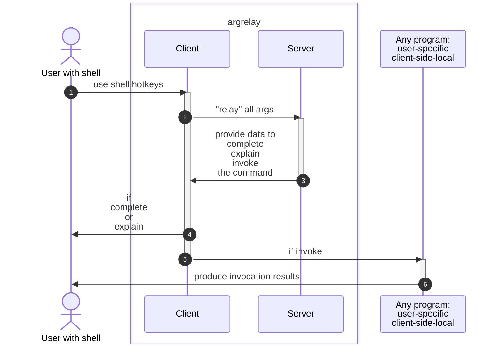
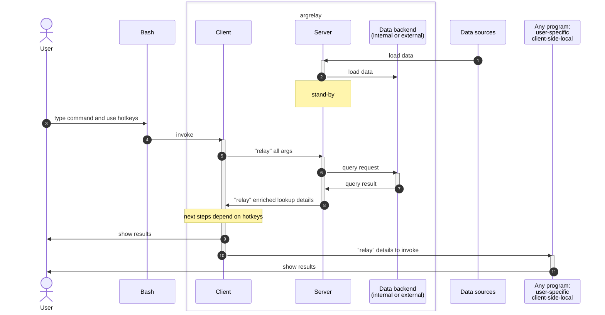

[](https://badge.fury.io/py/argrelay)
[](https://github.com/argrelay/argrelay/actions/workflows/argrelay.bootstrap.yaml)

<a name="argrelay-secreencast"></a>

[](https://asciinema.org/a/LTHj0DHN2kfXJCHCGuJugNG4P)

<!--
See: docs/dev_notes/screencast_notes.md
-->

<a name="argrelay-about"></a>

# What is [`argrelay`][argrelay_org]?

A wrapper for command line interface (CLI) tools<br/>
to search & select **custom data** input directly in the **standard shell**.

It integrates shell + client + server to enable local commands<br/>
with enriched data based on concise input syntax.

*   Although its initial purpose was command **auto-completion**, that become a trivial byproduct of...
*   Its primary target feature: keyword-based **structured data search**.

<a name="argrelay-purpose"></a>

# Why is it needed?

CLI is indispensable for **rapidly evolving custom tools**:
*   [A] **ubiquitous automation** (any command is effectively replay-able code)
*   [B] **quick implementation** (get it done "in the afternoon" without discussing fullstack API whole month)
*   [C] ultimate **manual intervention** (when everything else is already failed and unavailable)

Achieving all three [A, B, C] is **nearly impossible without** CLI.

And `argrelay` makes CLI more human-efficient by reducing manual and guess work:
*   enables **inline search directly in shell** (without copy-and-pasting args from other apps)
*   reduces cognitive load via feedback **eliminating syntax and options memorization**
*   unifies expectations for all commands via **generic data-driven** framework

See also ["general dilemma"][general_dilemma] below.

<a name="argrelay-execution"></a>

# How does it work?

It employs the same shell API as auto-completion for any other (e.g. `ls` or `git`) command,<br/>
except that requests go to the server with its **plugin**-s to run search logic against **indexed** data<br/>
(instead of processing requests locally by querying file system).

<a name="argrelay-name"></a>

### It is in the name

Essentially, sitting between the user shell and the user program,<br/>
`argrelay` "relays" command line args (hence, the name) to the server on each request,<br/>
then uses response data to complete/explain/invoke the command for the user:



See ["full picture"][full_picture] below.

<a name="argrelay-scenario"></a>

### Typical scenario

*   Human types in some **remembered** args (via `Tab`-auto-completion) in **relaxed syntax and order**.
*   Machine provides feedback (via `Alt+Shift+Q`-query) on the progress of the input interrogation - it tells:
    *   What args machine **already matched** with the data according to **command schema**.
    *   What **else** machine needs from human to **disambiguate** and select the remaining command args.

Try ["interactive demo"][interactive_demo] below.

<a name="argrelay-request-hotkeys"></a>

### Request hotkeys

There are 3 types of requests corresponding to 3 types of hotkeys.

| Bash:             | Server:                            | Client:                                     |
|-------------------|:-----------------------------------|:--------------------------------------------|
| **`Alt+Shift+Q`** | reports existing and missing input | displays command input interrogation status |
| **`Tab`**         | suggests options for missing input | lists options to Bash for auto-completion   |
| **`Enter`**       | provides data to invoke a command  | executes the command                        |

Apart from the trivial `Enter` to execute command,</br>
`Tab` and `Alt+Shift+Q` hotkeys are configured via [`Readline`][readline_config] library Bash relies on.

<!--

# Features

For sizeable and inter-dependent data, need for perf, relaxed syntax, keyword search, try [`argrelay`][argrelay_org].

*   Single server API for all commands.

    Commands behave differently because of the command line interpretation, local logic, and server data,<br/>
    not by extending server API.

*   Command execution is still trivially local to shell.

    The client only fetches more data from the server based on command line args before passing control to user code.

*   All security (auth and authz) to execute command must also be resolved by local process (just like for any script).

*   Precise structured search.

    It may appear fuzzy due to relaxed args order - but any ambiguity is resolved via simple rules of priority.

*   Support for any number of custom command names.

*   Support for any number of custom functions (registered).

    Functions are bound to any command name and args combination.

-->

<a name="argrelay-focus"></a>

# Project focus

> Data-assisted CLI with search and completion

GUI-s are targeted secondarily as they not have the restrictions vs the benefits CLI-s have:
*   To leverage minimal syntax queries, API requests can be handled from anything (including GUI).
*   But API-s are purposefully feature-tailored to support (both challenging and rewarding) CLI peculiarities.

<details>

<summary>show example</summary>

For example, in GUI-s, typing a query into a search bar may easily be accompanied by<br/>
[1] a separate (from the search bar) window area<br/>
[2] with individually selectable<br/>
[3] full-text-search results<br/>
[4] populated async-ly with typing...<br/>

In CLI-s, `grep` does [3] full-text-search,<br/>
but it is slow and completely misses the rest [1], [2], [4].

Also, simple full-text-search is imprecise - facilitating selection in CLI works best with:<br/>
a catalogue-like navigation selecting keywords via structured data search with auto-completion.

</details>

<!-- TODO: update the doc first before publishing its link
Learn more about [how search works][how_search_works.md].
-->

<!--

<a name="argrelay-overview"></a>

# Interaction overview

User is interrogated for each next input arg based on server knowledge of:
*   custom command **input schema**
*   custom data which matches already given input on the command line

Each command resembles "enum language":
*   Tokens are tags | labels | keywords from one of the `enum` sets.
*   The `enum` sets are the objects property values within user data.
*   Fuzzy-search (yet easily predictable) is achieved by:
    *   relying on rare intersection between `enum` sets
    *   allowing unordered args (using priorities to resolve arg type in case `enum` sets intersect)

Wrapping any command by `argrelay`:
*   provides generic help and navigation (see `Alt+Shift+Q` hotkey below)
*   naturally enables contextual auto-completion in Bash shell (see `Tab` hotkey below)
*   reduces cognitive load with minimalistic enum-based query syntax (matching target executable command line)
*   maintains small client-side footprint (suitable for resource-constrained terminals)
*   exposes conveniently browsable data inventory (generic CLI builder)

-->

<a name="argrelay-general-dilemma"></a>

# General dilemma

Neither GUI nor CLI will ever go way:

| GUI                                                                           | CLI                                                       |
|-------------------------------------------------------------------------------|-----------------------------------------------------------|
| :heavy_plus_sign: diagrams, images, video                                     | :heavy_multiplication_x: only via integration with GUI    |
| :heavy_minus_sign: might be time-consuming for an ad-hoc functionality        | :heavy_plus_sign: always quick dev option (low ceremony)  |
| :heavy_minus_sign: may not exist early in feature development                 | :heavy_plus_sign: likely available early in development   |
| :heavy_minus_sign: error is a pop-up requiring human attendance               | :heavy_plus_sign: error is an error code = ubiquitous API |
| :heavy_minus_sign: no simple way to store and share GUI output                | :heavy_plus_sign: store and share results as **text**     |
| :heavy_minus_sign: repeat steps 500 times? give up!                           | :heavy_plus_sign: repeat steps 500 time? loop!            |
| :heavy_minus_sign: no universal way to reproduce (composite) GUI actions      | :heavy_plus_sign: paste and "replay" commands as **text** |
| :heavy_minus_sign: no universal way to search stored GUI output               | :heavy_plus_sign: `grep`-search results as **text**       |
| :heavy_minus_sign: no universal way to compare GUI output                     | :heavy_plus_sign: `diff`-compare results as **text**      |
| :heavy_minus_sign: no universal way to auto-trigger GUI actions on events     | :heavy_plus_sign: hook commands anyhow (e.g. schedule)    |
| :heavy_minus_sign: a separate stack (skill set) from backend to contribute to | :heavy_plus_sign: familiarly dominates backend tools      |
| :heavy_minus_sign: uses APIs but hardly exposes API to integrate itself       | :heavy_plus_sign: inherent script-ability                 |
| :heavy_minus_sign: limits system access (a layer behind a narrow API)         | :heavy_plus_sign: ultimate control                        |
| :heavy_plus_sign: keyword captions                                            | :heavy_minus_sign: hardly remembered cryptic `-o` options |
| :heavy_plus_sign: point-click actions                                         | :heavy_minus_sign: increased typing:exclamation:          |
| :heavy_plus_sign: intuitive data-driven human interface                       | :heavy_minus_sign: human interface:question: API, in fact |

To resolve this dilemma, while retaining advantages of a CLI tool,<br/>
`argrelay` compensates for those last :heavy_plus_sign:-s by:
*   intuitive data-driven interface
*   reduced typing (args auto-reduction)
*   keyword options (args auto-completion)

<a name="argrelay-alternatives"></a>

# In search for alternatives

As opposed to GUI-demanding approaches like [Warp][Warp_site] or [IDEA terminal][IDEA_terminal]<br/>
(in desktop environment where any tool competes for installation),<br/>
`argrelay` is slim and survives everywhere in basic text modes (over telnet or SSH).

Also, none of these desktop tools allow building commands with custom input spec -<br/>
they simply augment interaction, in fact, they complement `argrelay` (as they may work together).

Alternatively, unlike this `argrelay` framework, independent [`argcomplete`][argcomplete_github] library:
*   :heavy_plus_sign: queries args directly from the source
*   :heavy_minus_sign: supports only `Tab`-completion
*   :heavy_minus_sign: does not search data inline
*   :heavy_minus_sign: does not provide feedback on input interrogation status
*   :heavy_minus_sign: does not eliminate irrelevant args
*   :heavy_minus_sign: uses stringent CLI syntax
*   :heavy_minus_sign: suffers performance limitations (no specialized data index)

<a name="argrelay-productivity"></a>

# Dev productivity

Given that `argrelay` target audience are devs (using shell),<br/>
the advantages of CLI tools over GUI can be summarized aspect-by-aspect:

| aspect          | :heavy_minus_sign: GUI | :heavy_plus_sign: CLI |
|-----------------|------------------------|-----------------------|
| **output**      | image                  | text                  |
| **interaction** | manual                 | automate-able         |
| **design**      | heavy                  | light                 |
| **languages**   | exclusive              | inclusive             |
| **integration** | denying                | composable            |
| **cycle**       | days                   | hours                 |
| **reviewers**   | many                   | few                   |
| **team**        | another                | same                  |
| **users**       | anyone                 | devs                  |
| **resources**   | max                    | min                   |

<a name="argrelay-original-use-case"></a>

# Original use case

It aimed at command auto-completion [based on arbitrary data sets][later_stack_question],<br/>
for example, using metadata for 10s x clusters, 100s x hosts, 1000s x processes, ...<br/>
(over 15K objects in total) **directly from the standard shell**.

Selecting args directly in shell CLI avoids **otherwise** error-prone<br/>
coping-and-pasting via clumsy GUI window switching.

Flexible and [responsive lookup][completion_perf_notes.md] required data indexing<br/>
(e.g. each Tab-request demands short loading and querying time for context-specific data)<br/>
which suggested a server...

<a name="argrelay-client-server"></a>

# Design choice: client-server vs static rules

The performance qualities are achieved by running a standby server with pre-loaded data<br/>
(instead of loading this data into each client).
> For example, with 1000s of data entries,<br/>
> even if someone could generate static Bash completion rules,<br/>
> it would take considerable time to load them for every shell instance.

Unlike static | generated | offline index per client,<br/>
standby server also naturally supports dynamic data updates.

# Interactive demo

This is a non-intrusive demo (e.g. without permanent changes to `~/.bashrc`).

Clone this repo somewhere (`@/` is [the project root][FS_29_54_67_86.dir_structure.md]).

Start `@/exe/relay_demo.bash` (it may take a couple of minutes to start for the first time):

```sh
./exe/relay_demo.bash
```

Optionally, review env state (any time):

```sh
./exe/check_env.bash
```

This sub-shell configures request hotkeys to bind `lay` command with `@/exe/run_argrelay_client`:

*   Interact with `lay` command (which uses [demo test data][TD_63_37_05_36.demo_services_data.md]):

    ```sh
    lay goto                 # press `Alt+Shift+Q` to describe available options
    ```

    ```sh
    lay goto host            # press `Tab` one or multiple times
    ```

    ```sh
    lay goto host dev        # press `Alt+Shift+Q` to observe changes in the output
    ```

    If executed (press `Enter`), it runs stub implementations
    (in real app it would do remote `ssh`-login for example).

*   Browse and retrieve data (for specific query):

    ```sh
    lay get ConfigOnlyClass ERROR
    ```

    `stdout` (one JSON per line):

    ```json
    {"envelope_payload": {"text_message": "text message C"}, "exit_code": "1", "envelope_class": "ConfigOnlyClass", "severity_level": "ERROR"}
    {"envelope_payload": {"text_message": "text message D"}, "exit_code": "2", "envelope_class": "ConfigOnlyClass", "severity_level": "ERROR"}
    ```

*   Replace this data (for specific query):

    `stdin` (one JSON per line):

    ```sh
    echo '
    {"envelope_payload": {"text_message": "text message C"}, "exit_code": "101", "envelope_class": "ConfigOnlyClass", "severity_level": "ERROR"}
    {"envelope_payload": {"text_message": "text message D"}, "exit_code": "102", "envelope_class": "ConfigOnlyClass", "severity_level": "ERROR"}
    ' |
    lay set ConfigOnlyClass ERROR
    ```

    <!--
    TODO: Remove NOTE below when all the docs and validations added.
    -->

    NOTE: Replacing data on the server is in alpha version
          (it misses validations allowing updates incompatible with schema).

*   To clean up, exit the sub-shell:

    ```sh
    exit
    ```

# Beyond the demo

*   While inside the sub-shell, inspect how auto-completion is configured for `relay_demo`:

    ```sh
    complete -p lay
    ```

*   See `@/logs/relay_demo.bash.log` of the background server:

    ```sh
    less ./logs/relay_demo.bash.log
    ```

*   Inspect configs:

    *   `@/conf/argrelay_client.json`
    *   `@/conf/argrelay_server.yaml`
    *   `@/conf/argrelay_plugin.yaml`

*   To reset the demo, remove `@/conf`:

    ```sh
    rm conf
    ```

    Script `@/exe/relay_demo.bash` relies on `@/conf` being a symlink specifically to `@/dst/relay_demo`:

    If `@/conf` is absent, it re-creates the symlink with that destination and re-installs everything.

*   To debug shell scripts, export `ARGRELAY_DEBUG` with value containing `s`:

    ```sh
    export ARGRELAY_DEBUG="s"
    ./exe/relay_demo.bash
    ```

<a name="primary-executables"></a>

# Primary executables

This table summarizes all executables most users ever need to know:

| Executable<br/>from `@/exe/` dir                        | Purpose                                                                      |
|:--------------------------------------------------------|:-----------------------------------------------------------------------------|
| [`check_env.bash`][FS_36_17_84_44.check_env.md]         | checks Bash/Python environments for any issues                               |
| [`bootstrap_env.bash`][FS_85_33_46_53.bootstrap_env.md] | bootstraps the environment (installs or upgrades `argrelay`)                 |
| [`dev_shell.bash`][FS_58_61_77_69.dev_shell.md]         | starts configured shell with activated `venv` and `argrelay`-linked commands |
| `shell_env.bash`                                        | script `source`-able by `~/.bashrc` to avoid starting `dev_shell.bash`       |
| `run_argrelay_server`                                   | runs `argrelay` server (in foreground)                                       |
| `run_argrelay_client`                                   | **not** used directly (invoked by `Alt+Shift+Q`-query and `Tab`-completion)  |

See [FS_29_54_67_86.dir_structure.md][FS_29_54_67_86.dir_structure.md] for details.

<a name="argrelay-includes"></a>

# What is in the package?

*   **Client** to be invoked by Bash hook on every Tab to<br/>
    send command line arguments to the server.
*   **Server** to parse command line and propose values from<br/>
    pre-loaded data for the argument under the cursor.
*   **Plugins** to customize:
    *   actions the client can run
    *   objects the server can search
    *   grammar the command line can have
*   **Interfaces** to bind these all together.
*   **Bootstrap** process to init the environment and maintain it.
*   **Demo** example to start from.
*   **Testing** support and coverage.

<a name="argrelay-backend"></a>

# Data backend

There are two options at the moment - both using [MongoDB][MongoDB] API:

| Category       | [`mongomock`][mongomock_github] (default)                                            | [`pymongo`][pymongo_github]                                                                      |
|:---------------|:-------------------------------------------------------------------------------------|:-------------------------------------------------------------------------------------------------|
| Data set size: | practical convenience limit ~ 10K objects                                            | tested with ~ 1M objects                                                                         |
| Pro:           | nothing else to install                                                              | no practical data set size limit found (yet)<br/> for `argrelay` intended use cases              |
| Con:           | understandably, does not meet<br/> performance requirements<br/> for large data sets | require some knowledge of MongoDB,<br/> additional setup,<br/> additional running processes<br/> |

Quantitative comparison tables between the two can be seen in docstring for `DistinctValuesQuery` enum.

<!--

`pymongo` connects to a running MongoDB instance which has to be configured in<br/>
`argrelay_server.yaml` under `mongo_config` and `mongomock` should be disabled:

```diff
-    use_mongomock: True
+    use_mongomock: False
```

-->

<a name="argrelay-full-picture"></a>

# Full picture



<a name="argrelay-feedback"></a>

# Feedback

Feel free to raise [issues][repo_issues] or [discussions][repo_discussions].

<!-- refs ---------------------------------------------------------------------------------------------------------- -->

[argrelay_org]: https://argrelay.org/
[Warp_site]: https://warp.dev/
[IDEA_terminal]: https://www.jetbrains.com/help/idea/terminal-emulator.html
[argcomplete_github]: https://github.com/kislyuk/argcomplete
[completion_perf_notes.md]: docs/dev_notes/completion_perf_notes.md
[MongoDB]: https://www.mongodb.com/
[TD_63_37_05_36.demo_services_data.md]: docs/test_data/TD_63_37_05_36.demo_services_data.md
[how_search_works.md]: docs/dev_notes/how_search_works.md
[repo_issues]: https://github.com/argrelay/argrelay/issues
[repo_discussions]: https://github.com/argrelay/argrelay/discussions
[FS_29_54_67_86.dir_structure.md]: docs/feature_stories/FS_29_54_67_86.dir_structure.md
[later_stack_question]: https://softwarerecs.stackexchange.com/questions/85247/
[mongomock_github]: https://github.com/mongomock/mongomock
[pymongo_github]: https://github.com/mongodb/mongo-python-driver
[FS_29_54_67_86.dir_structure.md]: docs/feature_stories/FS_29_54_67_86.dir_structure.md
[FS_36_17_84_44.check_env.md]: docs/feature_stories/FS_36_17_84_44.check_env.md
[FS_85_33_46_53.bootstrap_env.md]: docs/feature_stories/FS_85_33_46_53.bootstrap_env.md
[FS_58_61_77_69.dev_shell.md]: docs/feature_stories/FS_58_61_77_69.dev_shell.md
[general_dilemma]: #argrelay-general-dilemma
[full_picture]: #argrelay-full-picture
[interactive_demo]: #argrelay-demo
[readline_config]: https://www.gnu.org/software/bash/manual/html_node/Readline-Init-File-Syntax.html
