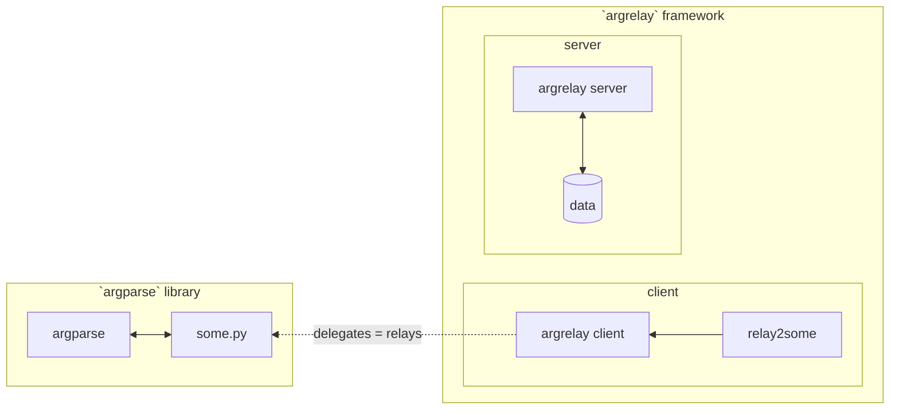

Project status: working prototype

<a name="argrelay-secreencast"></a>
[](https://asciinema.org/a/LTHj0DHN2kfXJCHCGuJugNG4P)

<!--
See: docs/dev_notes/screencast_notes.md
-->

<a name="argrelay-about"></a>
# What's this?

An integration framework to provide contextual Tab-auto-completion<br/>
and search for command line interfaces (CLI) in Bash shell.

<a name="argrelay-original-use-case"></a>
### Original use case

Auto-complete based on arbitrary structured data sets (e.g. config or ref data)</br>
**directly from standard shell**.[^1]

This requires data indexing for [responsive lookup][completion_perf_notes.md]<br/>
(the client has to start and find relevant data on each Tab-request).

The straightforward approach to meet performance requirements taken by `argrelay` is<br/>
to run a standby data server.
> For example, with several thousands of service instances,<br/>
> even if someone manages to generate Bash completion config,<br/>
> it takes considerable time to load it for every shell instance.

Unlike static|generated|offline index, standby server also naturally supports dynamic data updates.

<!--
<a name="argrelay-accidental-use-case"></a>
### Accidental use cases

Familiar terminal with:
*   data-intensive CLI and seamless search through live data
*   minimalistic enum-based query syntax
*   catalogues of selectable functions with unified/redefined CLI
-->

<a name="argrelay-name"></a>
# What's in a name?

Eventually, `argrelay` will "relay" command line arguments (hence, the name)<br/>
with associated data to user domain-specific program.

To clarify, let's compare side-by-side<br/>
(independent) `argparse` _library_ and `argrelay` _framework_:



| Category       | `argparse` is a library                                    | `argrelay` is a framework                                                      |
|:---------------|:-----------------------------------------------------------|:-------------------------------------------------------------------------------|
| Given:         | `some.py` is some script                                   | `relay2some` is a "wrapper" command<br/> configured in Bash to call `argrelay` |
| In Bash:       | type `some.py` to execute it                               | type `relay2some` to let `argrelay` decide<br/> whether to execute `some.py`   |
| Execution:     | `some.py` calls `argparse` library                         | `some.py` is called by the framework<br/> when `relay2some` is invoked         |
| Function:      | `some.py` directly does<br/> domain-specific task          | `relay2some` directly only "relays"<br/> the command line to `argrelay`        |
| CLI source:    | `some.py` defines its CLI<br/> itself via `argparse`       | CLI for `relay2some` is defined by<br/> the framework via configs/plugins/data |
| CLI is:        | mostly code-driven                                         | mostly data-driven                                                             |
| Modify CLI:    | modify `some.py`                                           | keep `some.py` intact,<br/> re-configure `argrelay` instead                    |
| Prog lang:     | `some.py` has to be<br/> a Python script to use `argparse` | `some.py` can be anything<br/> somehow executable by `argrelay`                |
| **Important:** | `some.py`/`argparse` have<br/> no domain data to query     | `relay2some` may access any<br/> domain data from `argrelay` server            |

<a name="argrelay-includes"></a>
# What's missing?

`argrelay` excludes:
*   Any (real) domain-specific data
*   Any (useful) domain-specific plugins

<a name="argrelay-excludes"></a>
# What's in the package?

`argrelay` includes:
*   **Client** to be invoked by Bash hook on every Tab to<br/>
    send command line arguments to the server.
*   **Server** to parse command line and propose values from<br/>
    pre-loaded data for the argument under the cursor.
*   **Plugins** to customize:
    *   actions the client can run
    *   objects the server can search
    *   grammar the command line can have
*   **Interfaces** to bind these all together.
*   **Demo** example to start from.
*   **Testing** support and coverage.

<a name="argrelay-focus"></a>
# CLI-friendly completion: primary focus

GUI-s are secondary for `argrelay`'s niche because<br/>
GUI-s do not have the restrictions CLI-s have:
*   Technically, the server can handle requests from anywhere (GUI).
*   But primary API-s are feature-tailored to support CLI (because everyone does GUI).

<details>
<summary>show example</summary>
For example, in GUI-s, typing a query into a search bar may easily be accompanied by<br/>
(1) a separate (from the search bar) window area<br/>
(2) with individually selectable<br/>
(3) full-text-search results<br/>
(4) populated **async-ly** with typing.<br/>

In CLI-s, `grep` does (3) full-text-search, but what about the rest (1), (2), (4)?

To facilitate selection of results,<br/>
catalogue-like navigation with auto-completion (rather than full-text-search)<br/>
seems the answer.
</details>

Nevertheless, GUI can also benefit from minimalist single line structured search queries.

<a name="argrelay-story"></a>
# Syntax: origin story

When an interface is limited...

You probably heard about research where<br/>
apes were taught to communicate with humans in sign language<br/>
(their vocal apparatus cannot reproduce speech effectively).

Naturally, with limited vocabulary,<br/>
they combined known words to describe unnamed things.

For example,<br/>
to ask for a watermelon (without knowing the exact sign),<br/>
they used combination of known "drink" + "sweet".

The default `argrelay` CLI-interpretation plugin (see `FuncArgsInterp`)<br/>
prompts for object properties to disambiguate search results until single one is found.

<details>
<summary>continue story</summary>

### Narrow down options

Without any context, just two words "drink" + "sweet" leave<br/>
a lot of ambiguity to guess a watermelon (many drinks are sweet).

A more clarified "sentence" could be:
> drink striped red sweet fruit

Each word narrows down matching object set<br/>
to more specific candidates (including watermelon).

### Avoid strict order

Notice that the word order is not important -<br/>
this line provides (almost) equivalent hints for guessing:
> striped sweet fruit red drink

It is not valid English grammar, but it somewhat works.

### Use "enum language"

Think of speaking "enum language":
*   Each word is an enum value of some enum type:
    *   Color: red, green, ...
    *   Taste: sweet, salty, ...
    *   Temperature: hot, cold, ...
    *   Action: drink, play, ...
*   Word order is irrelevant because _enum value spaces do not overlap_ (almost).
*   To "say" something, one keeps clarifying meaning by more enum values.

Now, imagine the enum types and values are not supposed to be memorized,<br/>
they are proposed to select from (based on the current context).

### Address any object

Suppose enums are binary = having only two values<br/>
(cardinality = 2: black/white, hot/cold, true/false, ...).

For example,<br/>
5 words could slice the object space to<br/>
single out (identify exactly) up to 2^5 = 32 objects.

To "address" larger object spaces,<br/>
larger enum cardinalities or more word places are required.

*   Each enum type ~ a dimension.
*   Each specific enum value ~ a coordinate.
*   Each object fills a slot in such multi-dimensional discrete space.

### Apply to CLI

CLI-s are used to write commands - imperative sentences:<br/>
specific actions on specific objects.

The "enum language" above covers searching both<br/>
an action and any object it requires.

### Suggest contextually

Not every combination of enum values may point to an existing object.

For data with sparse object spaces,<br/>
the CLI-suggestion can be shaped by coordinates applicable to<br/>
remaining (narrowed down) object sets.

### Differentiate on purpose

All above may be an obvious approach to come up with,<br/>
but it is not ordinary for CLI-s of most common commands (due to lack of data):

| Common commands (think `ls`, `git`, `ssh`, ...):                            | `argrelay`-wrapped actions:                           |
|:----------------------------------------------------------------------------|:------------------------------------------------------|
| have succinct syntax and prefer<br/> single-char switches (defined by code) | prefer explicit "enum language"<br/> defined by data  |
| rely on humans to memorize syntax<br/> (options, ordering, etc.)            | assume humans have<br/> a loose idea about the syntax |
| auto-complete only for objects<br/> known to the OS (hosts, files, etc.)    | auto-complete from<br/> a domain-specific data        |

</details>

Learn more about [how search works][how_search_works.md].

<a name="argrelay-demo"></a>
# Quick demo

This is a non-intrusive demo<br/>
(without permanent changes to user env, e.g. no `~/.bashrc` changes).

Clone this repo somewhere.

Run `@/exe/bootstrap_dev_env.bash`:

```sh
./exe/bootstrap_dev_env.bash
```

If `@/exe/bootstrap_dev_env.bash` is run for the first time,<br/>
it will ask to provide `@/conf/python_conf.bash` file and others.<br/>
Follow instruction on error.

To start both the server and the client,<br/>
two terminal windows are required.

*   Server:

    Start the first sub-shell:

    ```sh
    ./exe/dev_shell.bash
    ```

    In this sub-shell, start the server:

    ```sh
    # in server `@/exe/dev_shell.bash`:
    ./bin/run_argrelay_server
    ```

*   Client:

    Start the second sub-shell:

    ```sh
    ./exe/dev_shell.bash
    ```

    While it is running (temporarily),<br/>
    this sub-shell is configured for Bash Tab-completion for `relay_demo` command.

*   Try to `Tab`-complete command `relay_demo` using [demo test data][TD_63_37_05_36.demo_services_data.md]:

    ```sh
    # in client `@/exe/dev_shell.bash`:
    relay_demo goto host            # press Tab one or multiple times
    ```

    ```sh
    # in client `@/exe/dev_shell.bash`:
    relay_demo goto host dev        # press Alt+Shift+Q shortcut to describe command line args
    ```

*   Inspect how auto-completion binds to `relay_demo` command:

    ```sh
    # in client `@/exe/dev_shell.bash`:
    complete -p relay_demo
    ```

*   Inspect client and server config:

    *   server config: `~/.argrelay.conf.d/argrelay.server.yaml`
    *   client config: `~/.argrelay.conf.d/argrelay.client.json`

*   To clean up, exit the sub-shells:

    ```sh
    # in client or server `@/exe/dev_shell.bash`:
    exit
    ```

<a name="argrelay-backend"></a>
# Data backend

There are two options at the moment - both using [MongoDB][MongoDB] API:

| Category       | `mongomock` (default)                                                                   | `PyMongo`                                                                                        |
|:---------------|:----------------------------------------------------------------------------------------|:-------------------------------------------------------------------------------------------------|
| Data set size: | practical limit ~ 10K                                                                   | tested at 1M                                                                                     |
| Pro:           | nothing else to install                                                                 | no practical data set size limit found (yet)<br/> for `argrelay` intended use cases              |
| Con:           | understandably, does not meet<br/> non-functional requirements<br/> for large data sets | require some knowledge of MongoDB,<br/> additional setup,<br/> additional running processes<br/> |

`PyMongo` connects to running MongoDB instance which has to be configured in `mongo_config`<br/>
and `mongomock` should be disabled in `argrelay.server.yaml`:

```diff
-    use_mongomock_only: True
+    use_mongomock_only: False
```

<a name="argrelay-next-steps"></a>
# What's next?

*   Modify [`ServiceLoader.py` plugin][link_to_load_data_envelopes] to provide data beyond [demo data set][TD_63_37_05_36.demo_services_data.md].

    The data can be simply hard-coded with different `test_data` tag<br/>
    (other than `TD_63_37_05_36` demo) and selected in `argrelay.server.yaml`:

    ```diff
        ServiceLoader:
            plugin_module_name: argrelay.custom_integ.ServiceLoader
            plugin_class_name: ServiceLoader
            plugin_type: LoaderPlugin
            plugin_config:
                test_data_ids_to_load:
                    #-   TD_70_69_38_46  # no data
    -               -   TD_63_37_05_36  # demo
    +               -   TD_NN_NN_NN_NN  # custom data
                    #-   TD_38_03_48_51  # large generated
    ```

    If hard-coding is boring, soft-code to load it from external data source.

*   Replace [redirect to `ErrorDelegator.py` plugin][link_to_redirect_to_error]<br/>
    to execute something useful instead when use hits `Enter`.

*   ...

*   Many features and docs are actively taking their shape -<br/>
    any (minimal, unfiltered, first-thought) feedback is welcome.

    [Raise questions or suggestions as issues][repo_issues] to influence the dev direction.

### [footnotes]

[^1]: **Brief History**

    Tab-completion with custom (domain-specific) arg values is<br/>
    constantly on a dev wish list for complex backend.
    *   DEC 2022: Attempts to find an adequate solution for sizeable data yielded no results.
    *   JAN 2023: The [earlier question][earlier_stack_question] received zero activity for a month</br>
        (with a single silent downvote, auto-deleted by a bot).<br/>
        Request to restore it was &#127925; Shut Down In Flames.
        <!--
        It seeked recommendations which tend to be spammed by answers<br/>
        (controversially, some spam once a month helps more than none).
        -->
    *   FEB 2023: The [explanation hangs on the appropriate site][later_stack_question] now -<br/>
        recommendations are still very welcome there.<br/>
        But, with some patience for integration, `argrelay` already became satisfying enough.

<!-- refs ---------------------------------------------------------------------------------------------------------- -->

[completion_perf_notes.md]: docs/dev_notes/completion_perf_notes.md
[MongoDB]: https://www.mongodb.com/
[TD_63_37_05_36.demo_services_data.md]: docs/test_data/TD_63_37_05_36.demo_services_data.md
[earlier_stack_question]: https://stackoverflow.com/q/74996560/441652
[later_stack_question]: https://softwarerecs.stackexchange.com/questions/85247/
[how_search_works.md]: docs/dev_notes/how_search_works.md
[link_to_redirect_to_error]: https://github.com/argrelay/argrelay/blob/v0.0.0.dev27/src/argrelay/custom_integ/ServiceInvocator.py#L148
[link_to_load_data_envelopes]: https://github.com/argrelay/argrelay/blob/v0.0.0.dev27/src/argrelay/custom_integ/ServiceLoader.py#L111
[repo_issues]: https://github.com/argrelay/argrelay/issues
