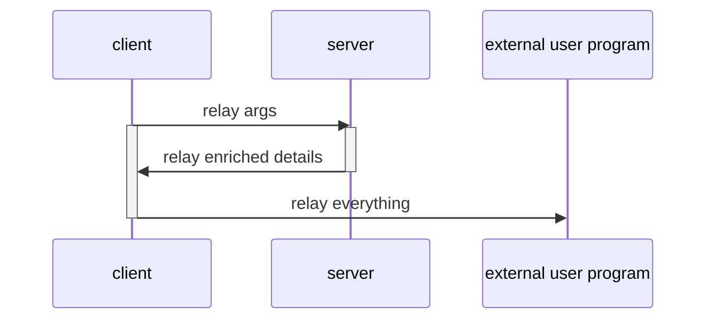

[](https://badge.fury.io/py/argrelay)
[](https://github.com/argrelay/argrelay/actions/workflows/argrelay.bootstrap.yaml)

<a name="argrelay-secreencast"></a>
[](https://asciinema.org/a/LTHj0DHN2kfXJCHCGuJugNG4P)

<!--
See: docs/dev_notes/screencast_notes.md
-->

<a name="argrelay-about"></a>
# What's this?

A integration framework to provide contextual Tab-auto-completion<br/>
and structured search filter for command line interface (CLI) to any command in Bash shell.

<a name="argrelay-general-idea"></a>
# General idea

| GUI                                                                            | CLI                                        |
|--------------------------------------------------------------------------------|--------------------------------------------|
| :heavy_minus_sign: prohibitively time-consuming for an ad-hoc functionality    | :heavy_plus_sign: quick dev option         |
| :heavy_minus_sign: consumes APIs but hardly integrates by exposing APIs itself | :heavy_plus_sign: essential script-ability |
| :heavy_minus_sign: limits system access                                        | :heavy_plus_sign: ultimate control         |
| :heavy_plus_sign: intuitive data lookup                                        | :heavy_minus_sign:                         |

While staying a CLI tool to retain other advantages, `argrelay` attempts to provide intuitive data lookup.

<a name="argrelay-original-use-case"></a>
# Original use case

Auto-complete based on arbitrary data sets (e.g. config or ref data)<br/>
**directly from standard shell** to run infra commands.

Flexible and [responsive lookup][completion_perf_notes.md] requires data indexing<br/>
(e.g. the client has to start and query relevant data on each Tab-request).

<a name="argrelay-client-server"></a>
# Straightforward split: client & server

The performance is achieved by running a standby server pre-loaded with data<br/>
(instead of loading this data into each client).
> For example, with several thousands of data entries,<br/>
> even if someone could generate Bash completion config,<br/>
> it would take considerable time to load it for every shell instance.

Unlike static|generated|offline index per client, standby server also naturally supports dynamic data updates.

<!--
<a name="argrelay-accidental-use-case"></a>
### Accidental use cases

Familiar terminal with:
*   data-intensive CLI and seamless search through live data
*   minimalistic enum-based query syntax
*   catalogues of selectable functions with unified/redefined CLI
-->

<a name="argrelay-name"></a>
# What's in a name?

CLI for any program is wrapped by `argrelay` interaction.

Eventually, `argrelay` will "relay" command line args around (hence, the name) with associated data:



<a name="argrelay-request-hotkeys"></a>
# Request hotkeys

|                   | Server maps CLI args, queries data, and: | Client receives server response and:        |
|-------------------|:-----------------------------------------|:--------------------------------------------|
| **`Alt+Shift+Q`** | explains given and missing input         | displays command completion status          |
| **`Tab`**         | suggests options for missing input       | lists options to Bash for auto-completion   |
| **`Enter`**       | provides data to invoke a command        | executes the command (via delegator plugin) |

<a name="argrelay-demo"></a>
# Interactive demo

This is a non-intrusive demo<br/>
(without permanent changes to user env, e.g. no `~/.bashrc` changes).

Clone this repo somewhere (`@/` is [the project root][FS_29_54_67_86.dir_structure.md]).

Run `@/exe/bootstrap_dev_env.bash`:

```sh
./exe/bootstrap_dev_env.bash
```

If `@/exe/bootstrap_dev_env.bash` is run for the first time,<br/>
it will ask to provide `@/conf/python_conf.bash` file and others.<br/>
Errors are designed to guide - please follow the instructions<br/>
(via full debug output) or [raise an issue][repo_issues].

To start both the server and the client,<br/>
two terminal windows are required.

*   Server:

    Start the first sub-shell:

    ```sh
    ./exe/dev_shell.bash
    ```

    In this sub-shell, start the server:

    ```sh
    # in server `@/exe/dev_shell.bash`:
    ./bin/run_argrelay_server
    ```

*   Client:

    Start the second sub-shell:

    ```sh
    ./exe/dev_shell.bash
    ```

    While it is running (temporarily),<br/>
    this sub-shell is configured for Bash Tab-completion for `relay_demo` command.

*   Try to `Tab`-complete command `relay_demo` using [demo test data][TD_63_37_05_36.demo_services_data.md]:

    ```sh
    # in client `@/exe/dev_shell.bash`:
    relay_demo goto host            # press Tab one or multiple times
    ```

    ```sh
    # in client `@/exe/dev_shell.bash`:
    relay_demo goto host dev        # press Alt+Shift+Q shortcut to describe command line args
    ```

*   Inspect how auto-completion binds to `relay_demo` command:

    ```sh
    # in client `@/exe/dev_shell.bash`:
    complete -p relay_demo
    ```

*   Inspect client and server config:

    *   server config: `@/conf/argrelay.server.yaml`
    *   client config: `@/conf/argrelay.client.json`

*   To clean up, exit the sub-shells:

    ```sh
    # in client or server `@/exe/dev_shell.bash`:
    exit
    ```

<a name="argrelay-includes"></a>
# What is in the package?

*   **Client** to be invoked by Bash hook on every Tab to<br/>
    send command line arguments to the server.
*   **Server** to parse command line and propose values from<br/>
    pre-loaded data for the argument under the cursor.
*   **Plugins** to customize:
    *   actions the client can run
    *   objects the server can search
    *   grammar the command line can have
*   **Interfaces** to bind these all together.
*   **Bootstrap** process to init the environment and maintain it.
*   **Demo** example to start from.
*   **Testing** support and coverage.

<a name="argrelay-focus"></a>
# Focus: CLI search and data-assisted completion

GUI-s are secondary for `argrelay`'s niche because<br/>
GUI-s do not have the restrictions CLI-s have:
*   Technically, the server can handle requests from anywhere (GUI).
*   But primary API-s are feature-tailored to support CLI (because everyone does GUI).

<details>
<summary>show example</summary>
For example, in GUI-s, typing a query into a search bar may easily be accompanied by<br/>
(1) a separate (from the search bar) window area<br/>
(2) with individually selectable<br/>
(3) full-text-search results<br/>
(4) populated **async-ly** with typing.<br/>

In CLI-s, `grep` does (3) full-text-search, but slow and what about the rest (1), (2), (4)?

To facilitate selection of results,<br/>
catalogue-like navigation via structured search (rather than full-text-search) with auto-completion<br/>
seems the answer.
</details>

Nevertheless, GUI can also benefit from minimalist single line structured search queries.

<!-- TODO: update the doc first before publishing its link
Learn more about [how search works][how_search_works.md].
-->

<a name="argrelay-backend"></a>
# Data backend

There are two options at the moment - both using [MongoDB][MongoDB] API:

| Category       | `mongomock` (default)                                                                   | `PyMongo`                                                                                        |
|:---------------|:----------------------------------------------------------------------------------------|:-------------------------------------------------------------------------------------------------|
| Data set size: | practical limit ~ 10K                                                                   | tested at 1M                                                                                     |
| Pro:           | nothing else to install                                                                 | no practical data set size limit found (yet)<br/> for `argrelay` intended use cases              |
| Con:           | understandably, does not meet<br/> non-functional requirements<br/> for large data sets | require some knowledge of MongoDB,<br/> additional setup,<br/> additional running processes<br/> |

`PyMongo` connects to running MongoDB instance which has to be configured in `mongo_config`<br/>
and `mongomock` should be disabled in `argrelay.server.yaml`:

```diff
-    use_mongomock_only: True
+    use_mongomock_only: False
```

<a name="argrelay-feedback"></a>
# Feedback

Feel free to [raise issues][repo_issues] for:
*   **any** questions (due to missing docs)
*   bugs
*   features

<!-- refs ---------------------------------------------------------------------------------------------------------- -->

[completion_perf_notes.md]: docs/dev_notes/completion_perf_notes.md
[MongoDB]: https://www.mongodb.com/
[TD_63_37_05_36.demo_services_data.md]: docs/test_data/TD_63_37_05_36.demo_services_data.md
[how_search_works.md]: docs/dev_notes/how_search_works.md
[repo_issues]: https://github.com/argrelay/argrelay/issues
[FS_29_54_67_86.dir_structure.md]: docs/feature_stories/FS_29_54_67_86.dir_structure.md
