[](https://badge.fury.io/py/argrelay)
[](https://github.com/argrelay/argrelay/actions/workflows/argrelay.bootstrap.yaml)

<a name="argrelay-secreencast"></a>
[](https://asciinema.org/a/LTHj0DHN2kfXJCHCGuJugNG4P)

<!--
See: docs/dev_notes/screencast_notes.md
-->

<a name="argrelay-about"></a>
# What's this?

A framework to "ergonomically" select **custom data** input for command line interface (CLI) tools.

The aim is to augment two-way &#10231; interaction by **prepared** reference data:
*   &#10230; Human inputs args that (s)he **remembers** (via `Tab`-auto-completion) in **relaxed order**.
*   &#10229; Machine provides feedback (via `Alt+Shift+Q` query) on current state:
    *   What args it already **matched** with server data according to **command schema**.
    *   What **else** it needs to fill remaining command args.

This broadens applicability of CLI input as a slim alternative to graphical user interface (GUI)
competing in **convenience** for apps especially for developers = "doing more with less".

*   When your data is instantly and directly queryable, try [`argcomplete`][argcomplete_github].
*   When your data is sizeable, users need perf (indexing), relaxed syntax, keyword search, try [`argrelay`][argrelay_org].

<a name="argrelay-focus"></a>
# `argrelay` focus

> Data-assisted CLI with search and completion

GUI-s are targeted secondarily as they not have the restrictions vs the benefits CLI-s have:
*   To leverage minimal syntax queries, API requests can be handled from anything (including GUI).
*   But API-s are purposefully feature-tailored to support (both challenging and rewarding) CLI.

<details>
<summary>show example</summary>
For example, in GUI-s, typing a query into a search bar may easily be accompanied by<br/>
(1) a separate (from the search bar) window area<br/>
(2) with individually selectable<br/>
(3) full-text-search results<br/>
(4) populated async-ly with typing...<br/>

In CLI-s, `grep` does (3) full-text-search, but slow and completely misses the rest (1), (2), (4).

Simple full-text-search is imprecise - facilitating selection in CLI requires:<br/>
a catalogue-like navigation via structured search with auto-completion.
</details>

<!-- TODO: update the doc first before publishing its link
Learn more about [how search works][how_search_works.md].
-->

<a name="argrelay-overview"></a>
# Interaction overview

User is interrogated for each next input arg based on:
*  custom command **input schema**
*  custom data which matches already given input

Each command resembles "enum language":
*   Tokens are tags | labels | keywords from one of the `enum` sets.
*   The `enum` sets are the objects property values within user data.
*   Fuzzy-search (yet easily predictable) is achieved by:
    *   relying on rare intersection between `enum` sets
    *   allowing unordered args (using priorities to resolve arg type in case `enum` sets intersect)

Wrapping any command by `argrelay`:
*   provides generic help and navigation (see `Alt+Shift+Q` hotkey below)
*   naturally enables contextual auto-completion in Bash shell (see `Tab` hotkey below)
*   reduces cognitive load with minimalistic enum-based query syntax (matching target executable command line)
*   maintains small client-side footprint (suitable for resource-constrained terminals)
*   exposes conveniently browsable data inventory (generic CLI builder)

<a name="argrelay-general-dilemma"></a>
# General dilemma

| GUI                                                                           | CLI                                                       |
|-------------------------------------------------------------------------------|-----------------------------------------------------------|
| :heavy_plus_sign: diagrams, images, video                                     | :heavy_multiplication_x: only via integration with GUI    |
| :heavy_minus_sign: might be time-consuming for an ad-hoc functionality        | :heavy_plus_sign: always quick dev option (low ceremony)  |
| :heavy_minus_sign: may not exist early in feature development                 | :heavy_plus_sign: likely available early in development   |
| :heavy_minus_sign: error is a pop-up requiring human attendance               | :heavy_plus_sign: error is an error code = ubiquitous API |
| :heavy_minus_sign: no simple way to store and share GUI output                | :heavy_plus_sign: store and share results as **text**     |
| :heavy_minus_sign: repeat steps 500 times? give up!                           | :heavy_plus_sign: repeat steps 500 time? loop!            |
| :heavy_minus_sign: no universal way to reproduce (composite) GUI actions      | :heavy_plus_sign: paste and "replay" commands as **text** |
| :heavy_minus_sign: no universal way to search stored GUI output               | :heavy_plus_sign: `grep`-search results as **text**       |
| :heavy_minus_sign: no universal way to compare GUI output                     | :heavy_plus_sign: `diff`-compare results as **text**      |
| :heavy_minus_sign: no universal way to auto-trigger GUI actions on events     | :heavy_plus_sign: hook commands anyhow (e.g. schedule)    |
| :heavy_minus_sign: a separate stack (skill set) from backend to contribute to | :heavy_plus_sign: familiarly dominates backend tools      |
| :heavy_minus_sign: uses APIs but hardly exposes API to integrate itself       | :heavy_plus_sign: inherent script-ability                 |
| :heavy_minus_sign: limits system access (a layer behind a narrow API)         | :heavy_plus_sign: ultimate control                        |
| :heavy_plus_sign: keyword captions                                            | :heavy_minus_sign: hardly remembered cryptic `-o` options |
| :heavy_plus_sign: point-click actions                                         | :heavy_minus_sign: increased typing:exclamation:          |
| :heavy_plus_sign: intuitive data-driven human interface                       | :heavy_minus_sign: human interface:question: API, in fact |

While retaining advantages of a CLI tool, `argrelay` tries to provide those last :heavy_plus_sign:-s:
*   intuitive data-driven interface
*   reduced typing (args auto-reduction)
*   keyword options (args auto-completion)

As opposed to GUI-demanding approaches like [Warp][Warp_site] or [IDEA terminal][IDEA_terminal],<br/>
`argrelay` survives in basic text modes.

Given that `argrelay` target audience are devs (using shell),<br/>
the advantages of CLI tools over GUI can be summarized property-by-property:

|                          | output    | interaction   | design | languages | integration | cycle | reviewers | team    | users  | resources |
|--------------------------|-----------|---------------|--------|-----------|-------------|-------|-----------|---------|--------|-----------|
| :heavy_minus_sign: GUI   | rigid     | manual        | heavy  | exclusive | denying     | days  | many      | another | anyone | max       |
| :heavy_plus_sign: CLI    | adaptable | automate-able | light  | inclusive | composable  | hours | few       | same    | devs   | min       |

<a name="argrelay-original-use-case"></a>
# Original use case

Auto-complete commands [based on arbitrary data sets][later_stack_question],<br/>
for example, using metadata for 10s x clusters, 100s x hosts, 1000s x processes, ...<br/>
**directly from standard shell**.

Selecting args directly in shell CLI avoids **otherwise** error-prone coping-and-pasting via clumsy GUI window switching.

Flexible and [responsive lookup][completion_perf_notes.md] required data indexing<br/>
(e.g. each Tab-request demands short loading and querying time for context-specific data)<br/>
which suggested a split...

<a name="argrelay-client-server"></a>
# Straightforward split: client & server

The performance qualities were achieved by running a standby server with pre-loaded data<br/>
(instead of loading this data into each client).
> For example, with 1000s of data entries,<br/>
> even if someone could generate static Bash completion config,<br/>
> it would take considerable time to load it for every shell instance.

Unlike static | generated | offline index per client, standby server also naturally supports dynamic data updates.

<a name="argrelay-request-hotkeys"></a>
# Request hotkeys

| Bash:             | Server:                            | Client:                                   |
|-------------------|:-----------------------------------|:------------------------------------------|
| **`Alt+Shift+Q`** | reports existing and missing input | displays command completion status        |
| **`Tab`**         | suggests options for missing input | lists options to Bash for auto-completion |
| **`Enter`**       | provides data to invoke a command  | executes the command                      |

<a name="argrelay-name"></a>
# What's in a name?

CLI for any program is wrapped by `argrelay` interaction and invoked by the user indirectly.

Eventually, `argrelay` "relays" command line args (hence, the name)<br/>
with associated data around to invoke the program selected by the user:


<a name="argrelay-demo"></a>
# Interactive demo

This is a non-intrusive demo (e.g. without permanent changes to `~/.bashrc`).

Clone this repo somewhere (`@/` is [the project root][FS_29_54_67_86.dir_structure.md]).

Start `@/exe/relay_demo.bash` (it may take a couple of minutes to start for the first time):

```sh
./exe/relay_demo.bash
```

Optionally, review env state (any time):

```sh
./exe/check_env.bash
```

This sub-shell configures request hotkeys to bind `lay` command with `@/exe/run_argrelay_client`:

*   Interact with `lay` command (which uses [demo test data][TD_63_37_05_36.demo_services_data.md]):

    ```sh
    lay goto                 # press `Alt+Shift+Q` to describe available options
    ```

    ```sh
    lay goto host            # press `Tab` one or multiple times
    ```

    ```sh
    lay goto host dev        # press Alt+Shift+Q to observe changes in the output
    ```

*   To clean up, exit the sub-shell:

    ```sh
    exit
    ```

# Beyond the demo

*   While inside the sub-shell, inspect how auto-completion is configured for `relay_demo`:

    ```sh
    complete -p lay
    ```

*   See `@/logs/relay_demo.bash.log` of the background server:

    ```sh
    less ./logs/relay_demo.bash.log
    ```

*   Inspect configs:

    *   `@/conf/argrelay_client.json`
    *   `@/conf/argrelay_server.yaml`
    *   `@/conf/argrelay_plugin.yaml`

*   To reset the demo, remove `@/conf`:

    ```sh
    rm conf
    ```

    Script `@/exe/relay_demo.bash` relies on `@/conf` being a symlink specifically to `@/dst/relay_demo`:

    If `@/conf` is absent, it re-creates the symlink with that destination and re-installs everything.

*   To debug shell scripts, export `ARGRELAY_DEBUG` with value containing `s`:

    ```sh
    export ARGRELAY_DEBUG="s"
    ./exe/relay_demo.bash
    ```

<a name="primary-executables"></a>
# Primary executables

This table summarizes all executables most users ever need to know:

| Executable from `@/exe/` dir                            | Purpose                                                                     |
|:--------------------------------------------------------|:----------------------------------------------------------------------------|
| [`check_env.bash`][FS_36_17_84_44.check_env.md]         | checks Bash/Python environments for any issues                              |
| [`bootstrap_env.bash`][FS_85_33_46_53.bootstrap_env.md] | bootstraps the environment (installs or upgrades `argrelay`)                |
| [`dev_shell.bash`][FS_58_61_77_69.dev_shell.md]         | starts shell session with activated `venv` and `argrelay`-linked commands   |
| `shell_env.bash`                                        | `source`-able by `~/.bashrc` to avoid starting `dev_shell.bash`             |
| `run_argrelay_server`                                   | runs `argrelay` server (in foreground)                                      |
| `run_argrelay_client`                                   | **not** used directly (invoked by `Alt+Shift+Q`-query and `Tab`-completion) |

See [FS_29_54_67_86.dir_structure.md][FS_29_54_67_86.dir_structure.md] for details.

<a name="argrelay-includes"></a>
# What's in the package?

*   **Client** to be invoked by Bash hook on every Tab to<br/>
    send command line arguments to the server.
*   **Server** to parse command line and propose values from<br/>
    pre-loaded data for the argument under the cursor.
*   **Plugins** to customize:
    *   actions the client can run
    *   objects the server can search
    *   grammar the command line can have
*   **Interfaces** to bind these all together.
*   **Bootstrap** process to init the environment and maintain it.
*   **Demo** example to start from.
*   **Testing** support and coverage.

<a name="argrelay-backend"></a>
# Data backend

There are two options at the moment - both using [MongoDB][MongoDB] API:

| Category       | [`mongomock`][mongomock_github] (default)                                            | [`pymongo`][pymongo_github]                                                                      |
|:---------------|:-------------------------------------------------------------------------------------|:-------------------------------------------------------------------------------------------------|
| Data set size: | practical convenience limit ~ 10K objects                                            | tested with ~ 1M objects                                                                         |
| Pro:           | nothing else to install                                                              | no practical data set size limit found (yet)<br/> for `argrelay` intended use cases              |
| Con:           | understandably, does not meet<br/> performance requirements<br/> for large data sets | require some knowledge of MongoDB,<br/> additional setup,<br/> additional running processes<br/> |

Quantitative comparison tables between the two can be seen in docstring for `DistinctValuesQuery` enum.

<!--

`pymongo` connects to a running MongoDB instance which has to be configured in<br/>
`argrelay_server.yaml` under `mongo_config` and `mongomock` should be disabled:

```diff
-    use_mongomock: True
+    use_mongomock: False
```

-->

<a name="argrelay-full-picture"></a>
# Full picture

```mermaid
sequenceDiagram
    autonumber
    actor U as <br/>User
    participant B as Bash
    participant P as Any program:<br/>user-required<br/>client-side-local
    box transparent <br/>argrelay
    participant C as Client
    participant S as Server
    participant DB as Data backend<br/>(internal or external)
    end
    participant DS as Data sources
    DS ->> S: load data
    activate S
    S ->> DB: load data
    deactivate S
    Note over S: <br/>stand-by<br/>
    U ->> B: enter command and use hotkeys
    B ->> C: invoke
    activate C
    C ->> S: "relay" all args
    activate S
    S ->> DB: query request
    activate DB
    DB ->> S: query result
    deactivate DB
    S ->> C: "relay" enriched lookup details
    deactivate S
    Note over C: next steps depend on hotkeys
    C ->> U: show results
    C ->> P: "relay" details to invoke
    deactivate C
    activate P
    P ->> U: show results
    deactivate P
```



<a name="argrelay-feedback"></a>
# Feedback

Feel free to raise [issues][repo_issues] or [discussions][repo_discussions].

<!-- refs ---------------------------------------------------------------------------------------------------------- -->

[argcomplete_github]: https://github.com/kislyuk/argcomplete
[argrelay_org]: https://argrelay.org/
[Warp_site]: https://warp.dev/
[IDEA_terminal]: https://www.jetbrains.com/help/idea/terminal-emulator.html
[completion_perf_notes.md]: docs/dev_notes/completion_perf_notes.md
[MongoDB]: https://www.mongodb.com/
[TD_63_37_05_36.demo_services_data.md]: docs/test_data/TD_63_37_05_36.demo_services_data.md
[how_search_works.md]: docs/dev_notes/how_search_works.md
[repo_issues]: https://github.com/argrelay/argrelay/issues
[repo_discussions]: https://github.com/argrelay/argrelay/discussions
[FS_29_54_67_86.dir_structure.md]: docs/feature_stories/FS_29_54_67_86.dir_structure.md
[later_stack_question]: https://softwarerecs.stackexchange.com/questions/85247/
[mongomock_github]: https://github.com/mongomock/mongomock
[pymongo_github]: https://github.com/mongodb/mongo-python-driver
[FS_29_54_67_86.dir_structure.md]: docs/feature_stories/FS_29_54_67_86.dir_structure.md
[FS_36_17_84_44.check_env.md]: docs/feature_stories/FS_36_17_84_44.check_env.md
[FS_85_33_46_53.bootstrap_env.md]: docs/feature_stories/FS_85_33_46_53.bootstrap_env.md
[FS_58_61_77_69.dev_shell.md]: docs/feature_stories/FS_58_61_77_69.dev_shell.md
